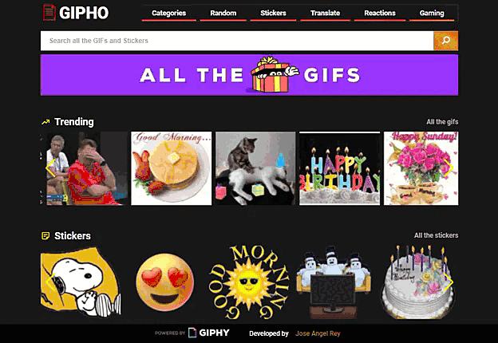
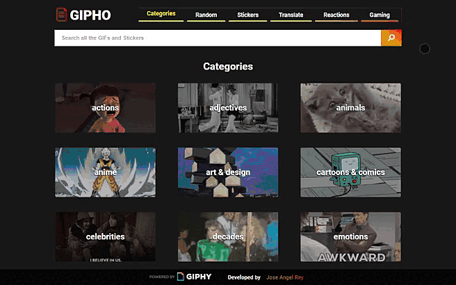
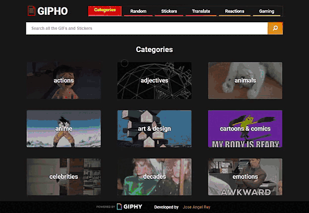
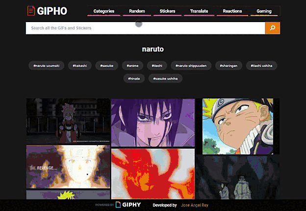

  <h1>GIPHY clone</h1>
  
  
  

  

<!--   [Go to GIPHO](https://github.com/matiassingers/awesome-readme) -->
<!--  -->

  

    The general idea of this project is to create a SPA (Single Page Application) that is a small-scale clone of the official GIPHY page from which you can have access to the most popular gifs and stickers, perform searches, have access to categories, search suggestions and the ability to translate a phrase or word to a gif, all this with a user interface as similar as possible to the original application (GIPHY).

    

All the data shown in this application is obtained thanks to the GIPHY API, which was used as the basis for the development of a REST API in the backend using Typescript, Node and Express.

      

The application was developed following a Mobile First methodology and used SASS, Typescript, React and Redux as frontend technologies.

## Tech Stack

**Frontend:** Typescript, React, Redux, SASS

**Backend:** Typescript, Node, Express

## Features

#### Frontend

- Carousel with trending gifs
- Categories section
- Detail view
- Infinite scroll
- Responsive web design
- Search bar
- Search suggestions
- Turn words and phrases into the perfect GIF or sticker

#### Backend endpoints

- GET / Categories
- GET / Detail
- GET / Random
- GET / Search
- GET / Stickers
- GET / Suggestions
- GET / Translate
- GET / Trending

## Screenshots

<!--  -->

 
 

 
 

 
 

 
 

<!-- ## Contact

 -->
